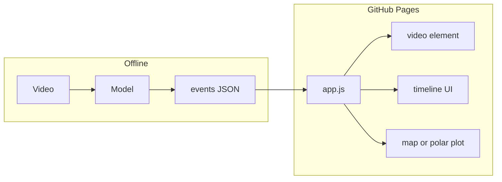

# Tech spec: Static interactive demo — “From waggle video to map”

**Goal:** A **static** site (HTML/CSS/JS only, no server) you can host on **GitHub Pages** that **explains and demonstrates** how AI turns bee waggle footage into **points or vectors on a map**, in a way a technical visitor can explore (scrub video, hover segments, see map update).

**Audience:** Practitioners, reviewers, or curious visitors who understand “model in → map out” but may not know bee dance decoding.

---

## 1. Assumptions (with a converged model)

1. **Offline inference exists** (Python/PyTorch or similar). The demo site **does not** train models.
2. **Per video** (or per short clip) you can produce a structured **timeline** of predicted events, for example:
   - `t_start`, `t_end` (seconds or frames)
   - `confidence`
   - **Duration** (seconds) — for distance encoding in classic dance biology
   - **Orientation** (degrees) *if* your future pipeline produces it; if not yet, the UI can show a **placeholder angle** or “TBD” with a clear legend
   - Optional: **2D image coordinates** of the bee / box center (for drawing overlays)
3. **Map conversion rule** is **documented in the UI**: e.g. “angle θ relative to up → bearing on map; duration → distance band (calibrated scale).” Even with a toy calibration, the story should be consistent.

**GitHub Pages reality check:** Running full R3D inference in-browser is possible but heavy (ONNX Runtime Web, large weights, CORS for model files). For a reliable, shareable demo, **precomputed JSON + short MP4/WebM** is the default recommendation; the spec below assumes that unless you explicitly scope “in-browser inference.”

---

## 2. Core narrative (what the demo proves)

1. **Input:** A short observational video (comb / arena).
2. **AI output:** Time segments where waggle is detected; optional per-segment duration and orientation.
3. **Decode:** Combine orientation + duration into a **foraging vector** (direction + qualitative or quantitative distance).
4. **Output:** **Pins or wedges on a map** (could be a stylized hive-centric map, a field map, or an abstract polar plot—your choice, but map-like).

The interaction should make step **3 → 4** feel **inspectable**, not magic.

---

## 3. Information architecture (pages / sections)

Single-page app is enough:

| Section | Purpose |
|--------|---------|
| **Hero / thesis** | One sentence: video → detections → map. |
| **Pipeline diagram** | Visual pipeline (static SVG or CSS). |
| **Interactive stage** | Video + timeline + map (main demo). |
| **Legend & biology** | Short von Frisch–style note (angle, duration); link to papers / your README. |
| **Limitations** | Full-frame vs per-bee, calibration, etc. |

No login, no cookies required.

---

## 4. Data contract (precomputed assets)

**Repo layout (example):**

```text
docs/                 # or root, depending on Pages source
  index.html
  app.js
  styles.css
  data/
    demo-manifest.json
    clips/
      arena_01.webm        # short, compressed
    runs/
      arena_01.json        # model output + geometry
```

**`demo-manifest.json`** (single source of truth for the demo):

- List of clips: `id`, `videoUrl`, `resultUrl`, `title`, optional `thumbnail`
- Global **calibration** knobs exposed to JS: e.g. `metersPerSecondOfWaggle`, `angleOffsetDeg` (documented as “toy calibration”)

**`arena_01.json`** (per clip), illustrative schema:

- `fps`, `frame_count` (optional)
- `events[]`:
  - `start_s`, `end_s`, `peak_s` (optional)
  - `confidence`
  - `duration_s` (dance duration estimate)
  - `angle_deg` (if available; else omit)
  - `bee_bbox` optional `[x,y,w,h]` normalized 0–1 for overlay
- `map_hints` (optional): precomputed `lat`, `lng` or **polar** `r`, `theta` in “dance space” for plotting

Version the schema (`schema_version: 1`) so you can regenerate files without breaking the page.

---

## 5. UX / interaction spec

### 5.1 Video panel

- HTML5 `<video>` with **controls**;
- Optional **canvas** overlay aligned to video for boxes (if `bee_bbox` present);
- **Play/pause** syncs timeline cursor.

### 5.2 Timeline

- Horizontal **scrub bar** with shaded **segments** for each `event` (color by confidence);
- **Click segment** → seek video to `start_s` or `peak_s`;
- **Hover** → tooltip with time range, confidence, duration, angle.

### 5.3 Map panel

Choose one (spec should pick one primary):

- **A. Leaflet + raster tiles** — real geography; needs tile provider (some require API keys; OpenStreetMap + proper attribution is common). Still static hosting; tiles load from CDN.
- **B. “Abstract map”** — SVG or Canvas **polar plot** around a hive icon: angle = direction, radius = monotonic function of duration. No external tiles; zero API keys; very **GitHub Pages–friendly**.

**Recommendation for v1:** **B** for reliability; optional **A** as v2.

Interactions:

- Selecting a timeline segment **highlights** the corresponding map glyph (wedge, arrow, pin);
- Optional slider: “calibration” multiplier to show sensitivity (educational).

### 5.4 Copy / education

- One paragraph tying **your model outputs** to **map parameters** (even if angle is still heuristic).
- Footnote that the demo uses **pre-run** inference JSON so the page stays fast and portable.

---

## 6. Technical stack (static constraints)

| Layer | Choice |
|--------|--------|
| Hosting | GitHub Pages from `main` / `docs/` or `gh-pages` branch |
| JS | Vanilla ES modules **or** a small bundled file (optional Vite build committed to `dist/`; still static) |
| Video | WebM/MP4, short clips (< ~10–20 MB total per demo for sanity) |
| Map option A | Leaflet + OSM tiles + attribution text in footer |
| Map option B | SVG/Canvas only |
| Styling | Plain CSS or minimal utility CSS; avoid heavy frameworks unless you want them |

**CORS:** All assets same-origin under `github.io/...` — fine if everything lives in the repo.

**Privacy:** No third-party trackers required; if you use OSM tiles, mention [tile usage policy](https://operations.osmfoundation.org/policies/tiles/).

---

## 7. Synchronization logic (client)

- Maintain `currentTime` from `timeupdate` event;
- **Active event** = event where `currentTime ∈ [start_s, end_s]` (or nearest by threshold);
- On segment click: `video.currentTime = start_s`;
- Map: maintain `selectedEventId` for keyboard/accessibility (arrow keys between events optional).

Keep logic in one module, e.g. `syncController.js`, so the story stays testable.

---

## 8. Accessibility & polish

- Keyboard: focusable timeline segments, Enter to seek;
- Reduced motion: disable non-essential CSS animations via `prefers-reduced-motion`;
- Color contrast for segments and map glyphs;
- **ES/EN** (or FR) toggle optional later (`data/i18n.json`) — no backend required.

---

## 9. Deliverables checklist

1. `index.html` + `app.js` + `styles.css`
2. `data/demo-manifest.json` + 1–2 clip bundles
3. README section: how to regenerate JSON from your Python infer script
4. LICENSE for code; license/attribution for map tiles if used
5. Optional: GitHub Action that **only** checks JSON schema (e.g. small Node script) — still free tier

---

## 10. Out of scope (v1)

- Live webcam inference
- User-uploaded videos on Pages (would need backend or huge client bundles)
- Multi-bee identity tracking (unless your JSON already encodes it)

---

## 11. Optional architecture sketch


